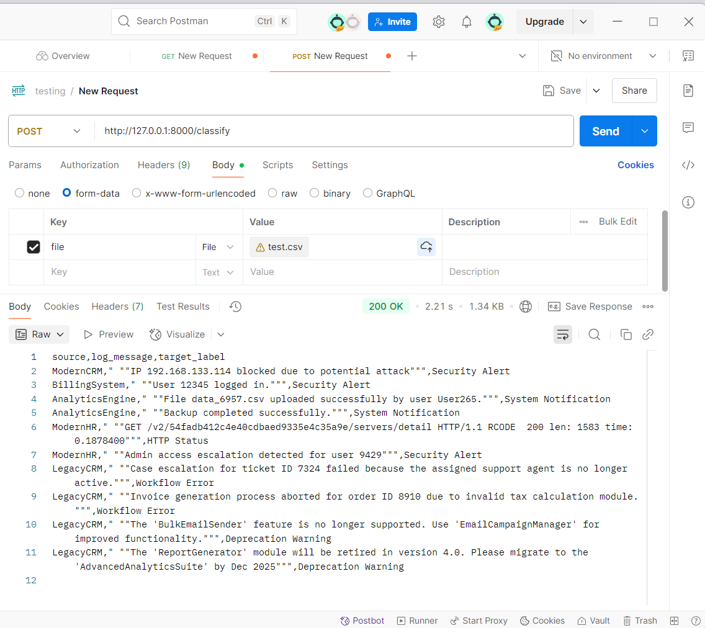

# Log Classification With Hybrid Classification Framework

This project implements a hybrid log classification system, combining three complementary approaches to handle varying levels of complexity in log patterns. The classification methods ensure flexibility and effectiveness in processing predictable, complex, and poorly-labeled data patterns.

---

## Classification Approaches

1. **Regular Expression (Regex)**:
   - Handles the most simplified and predictable patterns.
   - Useful for patterns that are easily captured using predefined rules.

2. **Sentence Transformer + Logistic Regression**:
   - Manages complex patterns when there is sufficient training data.
   - Utilizes embeddings generated by Sentence Transformers and applies Logistic Regression as the classification layer.

3. **LLM (Large Language Models)**:
   - Used for handling complex patterns when sufficient labeled training data is not available.
   - Provides a fallback or complementary approach to the other methods.


---

## Folder Structure

1. **`training/`**:
   - Contains the code for training models using Sentence Transformer and Logistic Regression.
   - Includes the code for regex-based classification.

2. **`models/`**:
   - Stores the saved models, including Sentence Transformer embeddings and the Logistic Regression model.

3. **`resources/`**:
   - This folder contains resource files such as test CSV files, output files, images, etc.

4. **Root Directory**:
   - Contains the FastAPI server code (`server.py`).

---

## Setup Instructions

1. **Install Dependencies**:
   Make sure you have Python installed on your system. Install the required Python libraries by running the following command:

   ```bash
   pip install -r requirements.txt
   ```

2. **Run the FastAPI Server**:
   To start the server, use the following command:

   ```bash
   uvicorn server:app --reload
   ```

   Once the server is running, you can access the API at:
   - `http://127.0.0.1:8000/` (Main endpoint)
   - `http://127.0.0.1:8000/docs` (Interactive Swagger documentation)
   - `http://127.0.0.1:8000/redoc` (Alternative API documentation)

---

## Usage

Upload a CSV file containing logs to the FastAPI endpoint for classification. Ensure the file has the following columns:
- `source`
- `log_message`

The output will be a CSV file with an additional column `target_label`, which represents the classified label for each log entry.

### Sample CSV file:
```csv
source,log_message
ModernCRM, "IP 192.168.133.114 blocked due to potential attack"
BillingSystem, "User 12345 logged in."
AnalyticsEngine, "File data_6957.csv uploaded successfully by user User265."
AnalyticsEngine, "Backup completed successfully."
ModernHR, "GET /v2/54fadb412c4e40cdbaed9335e4c35a9e/servers/detail HTTP/1.1 RCODE  200 len: 1583 time: 0.1878400"
ModernHR, "Admin access escalation detected for user 9429"
LegacyCRM, "Case escalation for ticket ID 7324 failed because the assigned support agent is no longer active."
LegacyCRM, "Invoice generation process aborted for order ID 8910 due to invalid tax calculation module."
LegacyCRM, "The 'BulkEmailSender' feature is no longer supported. Use 'EmailCampaignManager' for improved functionality."
LegacyCRM, "The 'ReportGenerator' module will be retired in version 4.0. Please migrate to the 'AdvancedAnalyticsSuite' by Dec 2025"
```

### Sample output:



---

## Contributing

If you find any issues or have suggestions for improvement, please create an issue or open a pull request. I always welcome contributions from the community!

---

## Thanks for your attention!